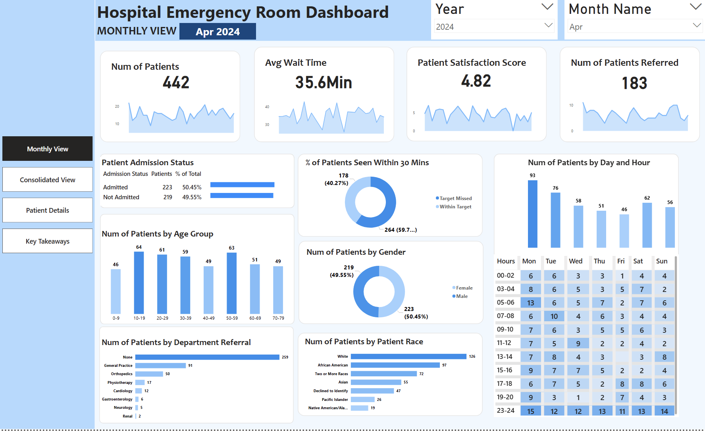
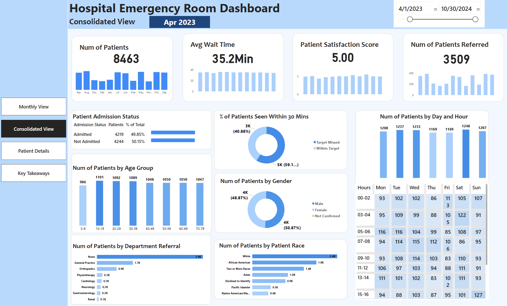
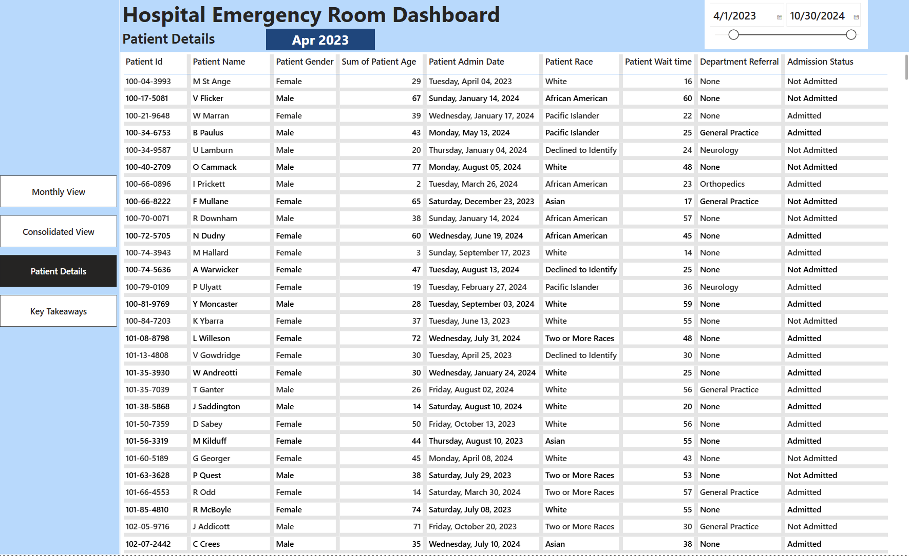

# Hospital-ER-Dashboard-Power-BI-
Interactive Power BI dashboard analyzing 9,216 emergency room patient records to identify trends in wait times, admissions, referrals, and operational efficiency, with actionable business recommendations.

## Project Overview
This project presents an interactive Power BI dashboard analyzing emergency room operations from April 2023 to October 2024. The dashboard evaluates patient volume, wait times, satisfaction scores, admissions, referrals, and demographic trends to identify operational inefficiencies and opportunities for improvement.

The dashboard contains four interactive views:

- Monthly View  
- Consolidated View  
- Patient Details  
- Key Takeaways  

This project demonstrates business intelligence, dashboard development, and healthcare data analysis skills using Power BI.

---

## Dashboard Screenshots

### Monthly View

### Consolidated View

### Patient Details View

---

## Dataset Summary

- Time period: April 2023 – October 2024  
- Total patients: 9,216  
- Average wait time: 35.3 minutes  
- Average satisfaction score: 4.99 / 10  

Key variables include:

- Admission status  
- Wait time  
- Satisfaction score  
- Department referral  
- Patient demographics  
- Admission timing  

---

## Key Insights

### Patient Volume and Admission Patterns
- Total patients: 9,216  
- Admitted patients: 4,612 (50%)  
- Non-admitted patients: 4,604 (50%)  

This indicates balanced admission and discharge rates.

---

### Wait Time and Satisfaction
- Average wait time: 35.3 minutes  
- Average satisfaction score: 4.99 / 10  

This suggests moderate patient satisfaction and opportunities to improve efficiency.

---

### Department Referrals
- 5,400 patients had no referral  
- Most common referrals:
  - General Practice: 1,840 patients  
  - Orthopedics: 995 patients  
  - Physiotherapy: 276 patients  
  - Cardiology: 248 patients  

---

### Peak Demand Periods
Busiest days:

- Monday: 1,377 patients  
- Saturday: 1,322 patients  
- Tuesday: 1,318 patients  

Busiest hours:

- 11 AM  
- 1 PM  
- 7 PM  
- 11 PM  

---

### Patient Demographics
Largest age groups:

- Age 30–39: 1,200 patients  
- Age 20–29: 1,188 patients  

Race distribution:

- White: 2,571  
- African American: 1,951  
- Multi-Racial: 1,557  
- Asian: 1,016  

---

## Business Recommendations
Based on the analysis, the following actions are recommended:

- Reduce patient wait times by improving patient flow and staffing efficiency  
- Increase staffing during peak hours and busiest days  
- Allocate additional resources to General Practice and Orthopedics  
- Improve operational efficiency to increase patient satisfaction  
- Monitor patient trends to optimize hospital resource planning  

These improvements can enhance operational efficiency and improve overall patient experience.

---

## Dashboard Features
- Interactive filters by date, demographics, and department  
- Drill-down capability for detailed analysis  
- Patient-level data view  
- KPI monitoring and performance tracking  

---

## Tools Used
- Power BI  
- Data Visualization  
- Data Analysis in Excel  
- Business Intelligence  

---

## Files Included

- `Hospital Emergency Room Dashboard.pbix`
- `Hospital ER_Data.csv`
- `screenshots/`
- `README.md`

---
